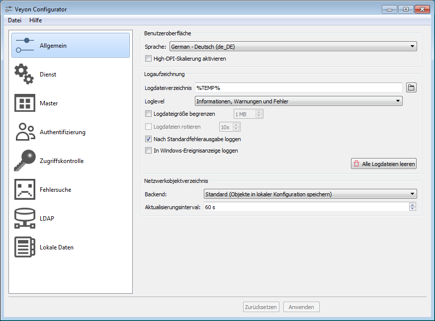

.. _Einrichtung:

Einrichtung
===========

Um mit der Einrichtung zu beginnen, starten Sie den Veyon Configurator, sofern dies nach Abschluss der Installation nicht schon automatisch erfolgt ist. Mit diesem Programm ist es möglich, eine lokale Veyon-Installation einzurichten und anzupassen. Die grafische Oberfläche ist dabei in verschiedene themen- bzw. komponentenbezogene Konfigurationsseiten untergliedert. Je nach installierten Plugins kann es zusätzliche Konfigurationsseiten geben.

Für einen Schnellstart zum Kennenlernen der Software müssen Sie zunächst nur die :ref:`Anmelde-Authentifizierung` aktivieren und in der Konfigurationsseite :ref:`Lokale Daten` einen Raum sowie einzelne Computer hinzufügen. Alle anderen Einstellungen können Sie auf den Vorgabewerten belassen.

Im weiteren Verlauf des Kapitels werden alle Konfigurationsseiten sowie alle Konfigurationsoptionen mit ihren jeweiligen Bedeutungen behandelt.

Allgemein
---------

Die grundlegenden Einstellungen auf der Hauptseite betreffen alle :ref:`Komponenten` von Veyon. Dazu zählen die Sprache, Logaufzeichnung sowie das Netzwerkobjektverzeichnis.

Benutzeroberfläche
++++++++++++++++++

Sprache
    Die verwendete Sprache für sowohl die grafischen Benutzeroberflächen als auch Kommandozeilenwerkzeuge kann bei Bedarf angepasst werden. Es stehen alle Sprachen zur Auswahl, für die eine teilweise oder vollständige Übersetzung vorliegt. Bitte beachten Sie, dass sich die Änderung der Sprache nach einem Programmneustart auswirkt. Beim standardmäßig eingestellten Vorgabewert passt sich Veyon an die im Betriebssystems eingestellte Sprache an, sofern die Sprache unterstützt wird. Andernfalls wird Englisch als Ausweichoption verwendet.

    **Vorgabe:** *Spracheinstellung des Systems verwenden*

High-DPI-Skalierung
    Beim Einsatz von Veyon auf hochaufgelösten Bildschirmen mit hoher Pixeldichte (DPI>150) sollte diese Option aktiviert werden. Sofern aktiviert werden die Benutzeroberflächen größer dargestellt, so dass vor allem visuelle Elemente mit Textbeschriftungen besser lesbar sind.

    **Vorgabe:** *deaktiviert*

Logaufzeichnung
+++++++++++++++

Über verschiedene Optionen kann das Verhalten der Logaufzeichnung beeinflusst werden. Diese Einstellungen sind vor allem dann interessant, wenn es zu Problemen beim Einsatz von Veyon kommt. Logdateien können hier Aufschluss über mögliche Fehlerursachen geben.

Logdateiverzeichnis
    Über diese Einstellung kann festgelegt werden, in welchen Ordner Logdateien abgelegt werden. Üblicherweise sollte hier eine Platzhaltervariable verwendet werden. Eine ausführliche Beschreibung möglicher Werte befindet sich in der :ref:`Konfigurationsreferenz` im Abschnitt :ref:`Platzhaltervariablen`.

    **Vorgabe:** *$TEMP*

Loglevel
    Der Loglevel legt fest, wie detailliert Logmeldungen aufgezeichnet werden. Bei der Fehlersuche kann es hilfreich sein, den Loglevel auf den Wert :guilabel:`Debugmeldungen und alles andere` festzulegen. Hierbei können sich allerdings schnell große Datenmengen ansammeln. Im Regelbetrieb sollten nur Warnungen und Fehler aufgezeichnet werden.

    **Vorgabe:** *Informationen, Warnungen und Fehler*

Logdateigröße begrenzen
    Damit die Logdateien im Laufe der Zeit nicht zu groß werden und unnötigen Speicherplatz belegen, kann deren Größe über diese Option begrenzt werden. Wenn aktiviert, kann eine obere Grenze für die Größe einzelner Logdateien eingestellt werden.

    **Vorgabe:** *deaktiviert / 1 MB*

Logdateien rotieren
    Im Zusammenspiel mit der Begrenzung der Logdateigröße kann es darüber hinaus hilfreich sein, die Logdateien zu rotieren. In diesem Fall wird eine Logdatei beim Erreichen der eingestellten Grenze nach ``Veyon...log.0`` umbenannt. Vorher rotierte Dateien werden so umbenannt, dass sich die Zahl in der Dateiendung immer um 1 erhöht. Ist die maximale Anzahl an Rotationen erreicht, wird die älteste Datei (d. h. mit der höchsten Zahl) gelöscht.

    **Vorgabe:** *deaktiviert / 10x*

Nach Standardfehlerausgabe loggen
    Wenn Programmkomponenten von Veyon in einem Kommandozeilenfenster ausgeführt werden, kann über diese Option festgelegt werden, ob Logmeldungen über den Kanal Standardfehlerausgabe (``stderr``) oder Standardausgabe (``stdout``) ausgegeben werden. Diese Einstellung ist in erster Linie für Scriptoperationen relevant.

    **Vorgabe:** *aktiviert*

In Windows-Ereignisanzeige loggen
    Für ein zentrales Management ist es in einigen Fällen hilfreich, Logmeldungen direkt in die Windows-Ereignisanzeige zu loggen. Diese Einstellung beeinflusst nicht die normale Logdateiaufzeichnung. Unter Linux ist die Einstellung wirkungslos.

    **Vorgabe:** *deaktiviert*

Über die Schaltfläche :guilabel:`Alle Logdateien leeren` können alle Veyon-Logdateien sowohl im Logdateiverzeichnis des aktuellen Benutzers als des Systemdiensts gelöscht werden.

.. _Netzwerkobjektverzeichnis:

Netzwerkobjektverzeichnis
+++++++++++++++++++++++++

Ein Netzwerkobjektverzeichnis stellt in Veyon Informationen über Netzwerkobjekte bereit. Netzwerkobjekte sind Computer sowie Räume, in denen sich  Computer befinden. Die Daten aus dem Netzwerkobjektverzeichnis werden vom Veyon Master verwendet, um Computerraumverwaltung mit Einträgen zu befüllen. Auch für die Zugriffskontrolle wird auf Daten im Netzwerkobjektverzeichnis zurückgegriffen. Standardmäßig wird ein Backend verwendet, das diese Daten in der lokalen Veyon-Konfiguration speichert und von dort ausliest, siehe Abschnitt :ref:`Lokale Daten`.

Backend
    Über diese Einstellung kann das gewünschte Netzwerkobjektverzeichnis-Backend gewählt werden. Abhängig von der Installation stehen neben dem Standard-Backend weitere Backends beispielsweise zur :ref:`LDAP` zur Verfügung.

    **Vorgabe:** *Standard (Objekte in lokaler Konfiguration speichern)*

Aktualisierungsintervall
    Das Netzwerkobjektverzeichnis kann im Hintergrund automatisch aktualisiert werden, was beim Einsatz von dynamischen Backends wie LDAP hilfreich sein kann. Das zeitliche Intervall für diese Aktualisierungen kann mit dieser Einstellung geändert werden.

    **Vorgabe:** *60 Sekunden*

Dienst
------

Die Einstellungen auf der Konfigurationsseite "Dienst" beeinflussen die Funktionsweise des Veyon-Diensts (Veyon Service) und dienen dem Finetuning in einigen Sonderfällen. Für einen reibungslosen Betrieb sollten die Einstellungen im Regelfall nicht geändert werden.

Allgemein
+++++++++

Icon im Infobereich verstecken
    Standardmäßig zeigt der Veyon-Dienst ein Icon im Infobereich (auch *Systemabschnitt der Kontrollleiste*) an, um den ordnungsgemäßen Betrieb sowie Informationen zur Programmversion und belegten Netzwerkports anzuzeigen. Die Anzeige des Icons kann unterbunden werden, indem diese Option aktiviert wird.

    **Vorgabe:** *deaktiviert*

SAS-Generierung in Software aktivieren (Strg+Alt+Entf)
    In der Standardkonfiguration ist es unter Windows für Anwendungsprogramme nicht möglich, die Secure-Attention-Sequence (Strg+Alt+Entf) zu generieren und somit den Druck dieser Tasten zu simulieren. Über diese Einstellung wird eine Policy in die Windows-Registry geschrieben, die dieses Verhalten ändert. Es wird empfohlen, diese Option aktiviert zu lassen, damit die Tastenkombination :kbd:`Strg+Alt+Entf` an einen ferngesteuerten Computer gesendet werden kann. Der ferngesteuerte Computer kann andernfalls z. B. nicht aus der Ferne entsperrt werden. Auch eine Nutzeranmeldung ist dann nicht möglich, da hierfür üblicherweise die Tasten :kbd:`Strg+Alt+Entf` gedrückt werden müssen.

    **Vorgabe:** *aktiviert*

Netzwerk
++++++++

Primärer Dienst-Port
    Diese Einstellung legt den primären Netzwerkport fest, auf dem der Veyon-Dienst lauscht und Verbindungen annimmt.

    **Vorgabe:** *11100**

Port des internen VNC-Servers
    Diese Einstellung legt den Netzwerkport fest, auf dem der interne VNC-Server arbeitet. Dieser Port ist nach außen nicht erreichbar und wird nur vom Veyon-Dienst verwendet, um über einen internen VNC-Server auf Bildschirmdaten zuzugreifen und diese nach außen weiterzuleiten.

    **Vorgabe:** *11200*

Funktionsverwalter-Port
    Diese Einstellung legt den Netzwerkport fest, auf dem der Funktionsverwalter arbeitet. Diese interne Komponente des Veyon-Diensts stellt die Schnittstelle zwischen Veyon-Dienst und Funktionsprozessen bereit. Funktionsprozesse laufen im Gegensatz zum Veyon-Dienst im Kontext des angemeldeten Benutzers aus und müssen daher über diese Schnittstelle mit dem Veyon-Dienst kommunizieren.

    **Vorgabe:** *11300*

Demoserver-Port
    Diese Einstellung legt den Netzwerkport fest, auf dem der Demo-Server arbeitet. Der Demo-Server stellt während einer Vorführung Bildschirmdaten des Lehrer-Rechners im Netzwerk zur Verfügung.

    **Vorgabe:** *11400*

Firewall-Ausnahme aktivieren
    Unter Windows kann ein Prozess je nach Systemkonfiguration unter Umständen nicht öffentlich auf einem Port lauschen, da Verbindungsanfragen durch die Windows-Firewall blockiert werden. Um den Zugriff auf den Dienst-Port sowie den Demoserver-Port zu ermöglichen, müssen Ausnahmen für die Windows-Firewall konfiguriert werden. Dies geschieht standardmäßig automatisch im Rahmen der Installation. Wenn dieses Verhalten nicht gewünscht ist und eine manuelle Konfiguration erfolgen soll, kann diese Option deaktiviert werden.

    **Vorgabe:** *aktiviert*

Nur Verbindungen vom lokalen Computer erlauben
    Wenn der Veyon-Dienst für andere Computer nicht erreichbar sein soll, kann diese Option aktiviert werden. Für normale Rechner, auf die mit dem Veyon Master zugegriffen werden soll, darf diese Option nicht aktiviert werden. Für Lehrer-Rechner kann die Option hingegen sinnvoll sein, um unabhängig von den Zugriffskontrolleinstellungen zusätzliche Sicherheit zu schaffen. Der Zugriff auf den Demoserver wird durch diese Einstellung nicht beeinflusst.

    **Vorgabe:** *deaktiviert*

VNC-Server
++++++++++

Plugin
    Standardmäßig verwendet Veyon eine interne plattformspezifische VNC-Server-Implementierung, um die Bildschirmdaten eines Rechners bereitstellen zu können. In einigen Sonderfällen kann es gewünscht sein, ein Plugin mit einer anderen Implementierung zu verwenden. Wenn beispielsweise bereits ein separater VNC-Server auf dem Computer installiert ist, kann dieser alternativ verwendet werden, indem das Plugin "Externer VNC-Server" gewählt wird. In diesem Fall müssen das Passwort und der Netzwerkport des VNC-Servers eingegeben werden.

    **Vorgabe:** *Eingebauter VNC-Server*

Master
------

Alle Einstellungen in der Konfigurationsseite "Master" betreffen ausschließlich das Verhalten und die Funktionen des Veyon Masters und gelten systemweit für alle Benutzer.

Verzeichnisse
+++++++++++++

Für die Verzeichniseinstellungen sollten Platzhaltervariablen anstatt absoluter Pfade verwendet werden, damit die Konfiguration generisch ist und benutzerunabhängig funktioniert. Eine ausführliche Beschreibung möglicher Werte befindet sich in der :ref:`Konfigurationsreferenz` im Abschnitt :ref:`Platzhaltervariablen`.

Benutzerkonfiguration
     In dem hier eingestellten Verzeichnis wird die benutzerspezifische Konfiguration des Master-Programms abgelegt. Diese Konfiguration beinhaltet Einstellungen der Benutzeroberfläche sowie die Computerauswahl der letzten Sitzung.

     **Vorgabe:** *$APPDATA/Config*

Bildschirmfotos
    In dem hier eingestellten Verzeichnis werden alle Bilddateien abgespeichert, die über die Bildschirmfoto-Funktion aufgenommen wurden. Wenn es beispielsweise gewünscht ist, die Dateien in einem zentralen Sammelordner abzulegen, kann hier ein anderer Verzeichnispfad eingetragen werden.

    **Vorgabe:** *$APPDATA/Screenshots*

Benutzeroberfläche & Verhalten
++++++++++++++++++++++++++++++

Zugriffskontrolle beim Programmstart durchführen
    Diese Einstellung legt fest, ob die ggf. konfigurierte :ref:`Computerzugriffskontrolle` auch beim Start des Veyon Masters durchgeführt werden soll. Auch wenn die Zugriffskontrolle in jedem Fall clientseitig durchgesetzt wird, kann diese zusätzliche Option dafür sorgen, dass Benutzer ohne Zugriffsrechte den Veyon Master gar nicht erst starten können und die Sicherheit damit noch sichtbarer wird.

    **Vorgabe:** *deaktiviert*

Beim Start automatisch zu aktuellem Raum wechseln
    Standardmäßig werden nach Start des Veyon Masters beim vorherigen Mal ausgewählten Computer angezeigt. Wenn stattdessen alle Computer des Raums angezeigt werden sollen, in dem sich der Master-Computer befindet, kann diese Option aktiviert werden. Der Veyon Master versucht dann über das eingestellte :ref:`Netzwerkobjektverzeichnis` zu ermitteln, zu welchem Raum der lokale Computer gehört. Alle Computer dieses Raums werden dann angezeigt.

    **Vorgabe:** *deaktiviert*

Nur aktuellen Raum in Computerraumverwaltung anzeigen
    Die Computerraumverwaltung listet standardmäßig alle Räume auf, die sich im eingestellten :ref:`Netzwerkobjektverzeichnis` befinden. Die Aktivierung dieser Option bewirkt hingegen, dass nur der Raum aufgeführt wird, in dem sich der Master-Computer befindet. Dies kann insbesondere in größeren Umgebungen die Übersichtlichkeit deutlich erhöhen.

    **Vorgabe:** *deaktiviert*

Manuelles Hinzufügen von Räumen zur Computerraumverwaltung erlauben
    Im Zusammenspiel mit der Option *Nur aktuellen Raum in Computerraumverwaltung anzeigen* kann optional erlaubt werden, weitere Räume manuell zur Computerraumverwaltung hinzuzufügen. Wenn die Option aktiviert ist, wird eine zusätzliche Schaltfläche :guilabel:`Raum hinzufügen` angezeigt, die einen Dialog mit allen verfügbaren Räumen öffnet.

    **Vorgabe:** *deaktiviert*

Lokalen Computer in Computerraumverwaltung ausblenden
    Im Regelbetrieb ist es oft nicht gewünscht, den eigenen Computer anzuzeigen und raumweit aktivierte Funktionen auch auf dem eigenen Computer zu aktivieren (z. B. Bildschirmsperre). Wenn ein solches Verhalten gewünscht ist, kann diese Option aktiviert werden.

    **Vorgabe:** *deaktiviert*

Leere Räume in Computerraumverwaltung ausblenden
    Unter bestimmten Umständen befinden sich im :ref:`Netzwerkobjektverzeichnis` Räume ohne Computer, beispielsweise aufgrund von bestimmten LDAP-Filtern. Solche leeren Räume können über diese Option aus der Computerraumverwaltung ausgeblendet werden.

    **Vorgabe:** *deaktiviert*

Filterfeld für Computer in Computerraumverwaltung ausblenden
    Das Filterfeld zum Suchen von Computern kann über diese Option bei Bedarf ausgeblendet werden, um in überschaubaren Umgebungen die Benutzeroberfläche möglichst einfach zu halten.

    **Vorgabe:** *deaktiviert*

Funktion bei Doppelklick
    Wenn ein Computer im Veyon Master doppelt angeklickt wird, kann eine vorgegebene Funktion gestartet werden. Üblich ist hier die Verwendung der Funktionen *Fernsteuerung* oder *Fernansicht*.

    **Vorgabe:** *<Keine Funktion>*

Funktionen
++++++++++

Über die zwei Listen im Abschnitt :guilabel:`Funktionen` kann voreingestellt werden, welche Funktionen im Veyon Master verfügbar sind. Einzelne Funktionen können somit bei Bedarf deaktiviert werden, so dass entsprechende Schaltflächen und Kontextmenüeinträge im Veyon Master nicht angezeigt werden. Dies kann die Übersichtlichkeit der Benutzeroberfläche erhöhen, wenn bestimmte Funktionen sowieso nicht verwendet werden sollen.

Eine Funktion kann in die jeweils andere Liste verschoben werden, indem sie markiert und die jeweilige Schaltfläche mit den Pfeilsymbolen betätigt wird. Zusätzlich hat auch ein Doppelklick auf eine Funktion die gleiche Wirkung.

Authentifizierung
-----------------

Damit auf einen Computer zugegriffen werden kann, auf dem der Veyon-Dienst läuft, muss sich der zugreifende Benutzer zunächst authentifizieren, d. h. seine Identität bzw. Nutzungsberechtigung nachweisen. Andernfalls wäre ein uneingeschränkter Zugriff von jedem Nutzer auf jeden Computer möglich, auf dem der Veyon-Dienst läuft. Ein Zugriff ohne Authentifizierung ist somit nicht möglich.

Authentifizierungsmethoden
++++++++++++++++++++++++++

Grundlegend stehen in Veyon mit der Schlüsseldatei-Authentifizierung sowie der Anmelde-Authentifizierung zwei verschiedene Authentifizierungsmethoden Verfügung, die einzeln oder ergänzend parallel eingesetzt werden können.

Die **Schlüsseldatei-Authentifizierung** basiert auf einem `Public-Key-Verschlüsselungsverfahren <https://de.wikipedia.org/wiki/Public-Key-Verschl%C3%BCsselungsverfahren>`_, d. h. es kommen ein öffentlich bekannter Schlüssel und ein zugehöriger privater Schlüssel zum Einsatz, auf den nur bestimmte Benutzer Zugriff haben dürfen. Bei einer Verbindungsanfrage sendet der Veyon-Dienst eine zufällige Zeichenfolge an den Gegenüber, die dieser mit Hilfe des privaten Schlüssels kryptografisch signieren muss. Die Signatur wird an den Veyon-Dienst zurückgesendet und anhand des öffentlichen Schlüssels überprüft. Diese Überprüfung ist nur dann erfolgreich, wenn die Signatur mit dem passenden privaten Schlüssel erzeugt wird. Die Authentizität des Gegenübers ist dann sichergestellt. Schlägt die Signaturüberprüfung fehl, wird die Verbindung geschlossen.

Bei der **Anmelde-Authentifizierung** sendet der Gegenüber verschlüsselt seinen Benutzername und sein Kennwort an den Veyon-Dienst. Mit diesen Zugangsdaten versucht der Veyon-Dienst anschließend eine Benutzeranmeldung am lokalen System. Schlägt diese fehl, wird die Verbindung geschlossen. Andernfalls sind Benutzername und Kennwort korrekt, so dass die Authentizität des Gegenübers sichergestellt ist.

Beide Methoden haben Vor- und Nachteile, so dass die Wahl der richtigen Methode von der Umgebung, den Sicherheitsanforderungen und den Komfortwünschen abhängt.

**Schlüsseldatei-Authentifizierung**

+-------------------------------------------------+-------------------------------------------------+
| Vorteile                                        | Nachteile                                       |
+=================================================+=================================================+
| * keine Anmeldung mit Benutzername und Passwort | * höherer Aufwand bei der Einrichtung           |
|   beim Start des Veyon Masters notwendig        | * tatsächlicher Benutzer kann auch nach         |
| * Zugriff auf Computer kann über Zugriffsrechte |   erfolgreicher Signaturprüfung nicht           |
|   auf private Schlüsseldatei einfach und        |   zweifelsfrei sichergestellt werden            |
|   zentral gesteuert werden                      | * Systemweiter Austausch von kompromittierten   |
|                                                 |   Schlüsselpaaren notwendig                     |
+-------------------------------------------------+-------------------------------------------------+

**Anmelde-Authentifizierung**

+-------------------------------------------------+-------------------------------------------------+
| Vorteile                                        | Nachteile                                       |
+=================================================+=================================================+
| * einfache und aufwandsarme Einrichtung         | * Anmeldung mit Benutzername und Passwort bei   |
| * zweifelsfreie Sicherstellung der Identität    |   jeder Verwendung des Veyon Masters notwendig  |
|   des Gegenübers, so dass effektive und sichere |                                                 |
|   Computerzugriffskontrolle_ möglich ist        |                                                 |
+-------------------------------------------------+-------------------------------------------------+

Schlüsselverwaltung
+++++++++++++++++++

.. _Anmelde-Authentifizierung:

Anmelde-Authentifizierung
+++++++++++++++++++++++++

Zugriffskontrolle
-----------------

.. _Computerzugriffskontrolle:

Computerzugriffskontrolle
+++++++++++++++++++++++++

Autorisierte Benutzergruppen für Computerzugriff
++++++++++++++++++++++++++++++++++++++++++++++++

Zugriffskontrollregeln
++++++++++++++++++++++

Fehlersuche
-----------

LDAP
----

Alle Informationen rund um die Anbindung von Veyon an einen LDAP-/ActiveDirectory-Server finden Sie gesondert im Kapitel :ref:`LDAP`.

.. _Lokale Daten:

Lokale Daten
------------
