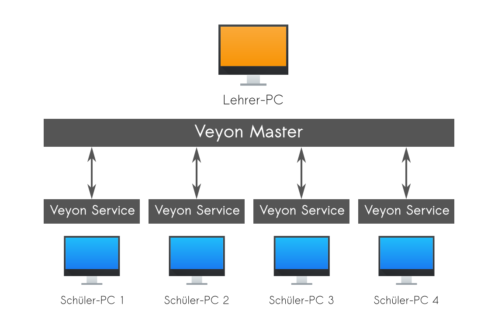
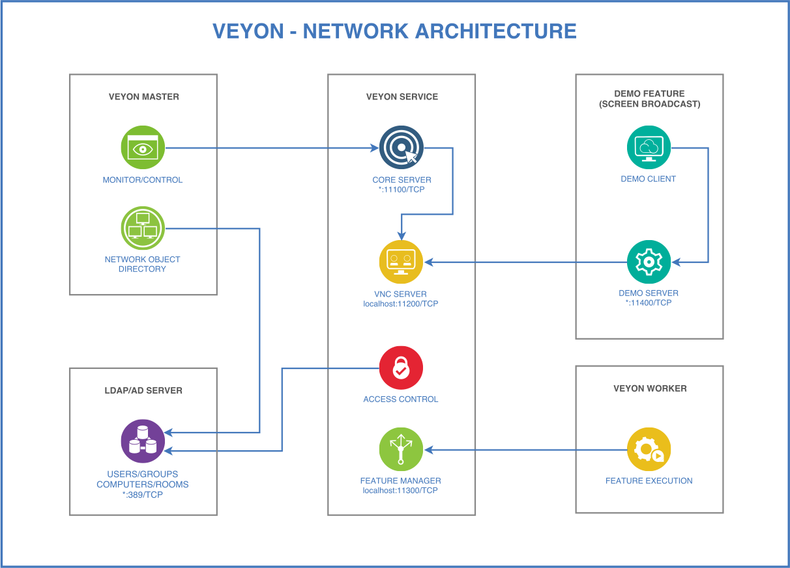

Einführung
==========

Über dieses Handbuch
--------------------

Dieses Handbuch beschreibt die Installation und Einrichtung von Veyon in einem Computernetzwerk und richtet sich an Administratoren und technisch versierte Benutzer. Für Endanwender gibt es ein separates Benutzerhandbuch, in dem die Bedienung sowie die einzelnen Funktionen des Anwenderprogramms (Veyon Master) beschrieben sind.

In weiteren Abschnitten dieses Kapitels finden Sie grundlegende Informationen über Veyon und seine Bestandteile, die für die Inbetriebnahme von elementarer Bedeutung sind.

Im Kapitel :ref:`Installation` wird die Installation von Veyon auf einem Windows- oder Linux-Computer behandelt. Hier finden Sie auch Hinweise, wie Sie die Installation automatisiert durchführen können.

Die Einrichtung und Integration mit Hilfe des grafischen Einrichtungswerkzeugs sind im Kapitel :ref:`Einrichtung` allgemein beschrieben, während sich die :ref:`Konfigurationsreferenz` im Detail mit den verschiedenen Einstelloptionen befasst. Die Anbindung an einen LDAP-/ActiveDirectory-Server wird im Kapitel :ref:`LDAP` ausführlich behandelt.

Veyon verfügt weiterhin über eine Kommandozeilenschnittstelle (:index:`CLI`), über die sich Konfigurationsanpassungen vornehmen lassen und bestimmte Programmfunktionen verwendet oder gesteuert werden können. Alle Module und Befehle des Kommandozeilenwerkzeugs sind im Kapitel :ref:`Kommandozeilenschnittstelle` aufgeführt und erläutert.

Bei Problemen mit Veyon können Sie das Kapitel :ref:`Troubleshooting` konsultieren. Hier finden Sie Maßnahmen zur Fehleranalyse und -behebung. Häufig gestellte Fragen werden im Kapitel :ref:`FAQ` beantwortet.

Über Veyon
-----------

Veyon ist eine quelloffene Software für Computer-Monitoring und Klassenraumverwaltung. Sie erlaubt die Beobachtung und Steuerung von Computerräumen sowie die Interaktion mit Benutzern. Die wichtigsten Funktionen von Veyon sind:

* Überblick über einen (Klassen-)Raum mit allen Bildschirminhalten in einer Kachelansicht
* Fernsteuerung von Computern
* Übertragung des Lehrerbildschirms an alle anderen Computer in Echtzeit (Vollbild/Fenster)
* Sperren von Arbeitsplätzen zur Aufmerksamkeitslenkung
* Textnachrichten an Schüler senden
* Computer aus der Ferne ein- oder ausschalten sowie neustarten
* Benutzer abmelden
* Programme ausführen oder Websiten öffnen

.. index:: Lehrer-Computer, Schüler-Computer, Master-Computer, Client-Computer

.. _Komponenten:

Komponenten
-----------

Veyon besteht im Grundprinzip aus einer Master- und einer Service-Komponente, die das Zusammenspiel zwischen Lehrer- und Schüler-Computern (auch *Master-Computer* und *Client-Computer*) realisieren:

Im Detail gibt es verschiedene :index:`Programmkomponenten`, die auf verschiedene Art und Weise miteinander interagieren:

.. image:: images/architecture.png
   :scale: 50 %
   :align: center

:index:`Veyon Master`
    Anwendungsprogramm, mit dem andere Computer beobachtet und gesteuert und Veyon-Funktionen genutzt werden können. Das Programm wird im regulären Anwendungsfall vom Endanwender gestartet und greift über den Veyon Service auf die Computer zu.

:index:`Veyon Service`
    Ein nicht-grafisches Dienstprogramm, das Benutzersitzungen auf einem Computer überwacht und Veyon-Server-Instanzen innerhalb dieser Sitzungen startet. Der Dienst und seine Server-Unterprozesse müssen auf allen Computern einschließlich der Lehrercomputer ausgeführt werden.

:index:`Veyon Server`
    Eine Server-Anwendung, die Zugriff auf einen Computer sowie Steuerungs- und Anwendungsfunktionen bietet. Im Regelfall wird dieses Programm vom Veyon-Dienst automatisch und mit erhöhten Rechten gestartet, so dass es von den Benutzern nicht beendet werden kann.

:index:`Veyon Worker`
    Hilfsprogramm, das vom Service gestartet wird, um bestimmte Funktionen isoliert und/oder im Kontext des angemeldeten Benutzers bereitzustellen. Dazu zählen beispielsweise der Demoserver auf dem Lehrer-Computer oder der Democlient auf Schüler-Computern.

:index:`Veyon Configurator`
    :index:`Konfigurationswerkzeug`, welches die Einrichtung und Anpassung aller Komponenten einer lokalen Veyon-Installation über eine grafische Benutzeroberfläche ermöglicht. Das Programm wird bei Bedarf vom Administrator mit erhöhten Privilegien gestartet.

:index:`Veyon Control`
    Kommandozeilenwerkzeug, das als Ergänzung zum Veyon Configurator ohne grafische Interaktion verschiedene Konfigurationsanpassungen und die Verwendung einiger Veyon-Funktionen erlaubt. Das Programm wird entweder interaktiv auf der Kommandozeile oder scriptgesteuert mit üblicherweise administrativen Privilegien ausgeführt.

Netzwerkarchitektur
-------------------

Aus Netzwerksicht ergibt sich das in der folgenden Grafik dargestellte Zusammenspiel der einzelnen Komponenten und TCP-Ports:

