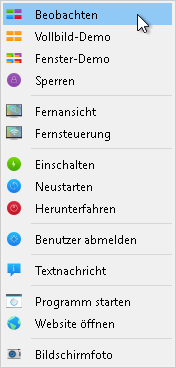
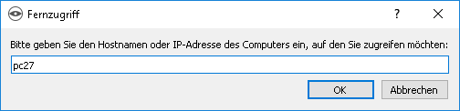
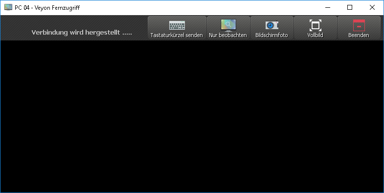
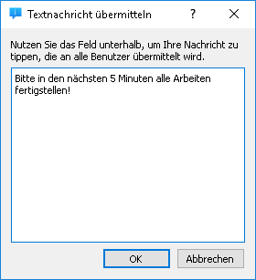
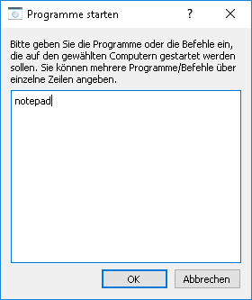
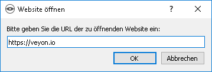

.. _Programmfunktionen:

Programmfunktionen
==================

Veyon stellt eine Vielzahl an Funktionen bereit, mit denen Sie Computer steuern und auf sie zugreifen können. Alle Funktionen sind in der Werkzeugleiste übersichtlich angeordnet und sind ebenso über das Kontextmenü erreichbar.

Wenn Sie mit der Maus über die einzelnen Schaltflächen in der Werkzeugleiste fahren, wird ein :index:`Tooltip` mit einem kurzen Hilfstext angezeigt, sofern Sie diese nicht deaktiviert haben. Die Betätigung einer Schaltfläche aktiviert die gewählte Funktion für alle angezeigten Computer.

.. _Computerauswahl:
.. index:: Computerauswahl

Computer auswählen
------------------

Wenn Sie eine Funktion nur auf einem einzelnen Computer aktivieren möchte, klicken Sie diesen mit der rechten Maustaste an und wählen die gewünschte Funktion über das Kontextmenü.

Weiterhin können Sie mehrere Computer auswählen, indem Sie mit der Maus ein Auswahlrechteck ziehen und dabei alle gewünschten Computer einschließen:

.. image:: images/select-computers.png
   :scale: 75 %
   :align: center

Alternativ können Sie die Taste :kbd:`Strg` drücken und Computer einzeln anklicken, um sie zur Auswahl hinzuzufügen.

Beobachtungsmodus
-----------------

Standardmäßig befindet sich das Programm im Beobachtungsmodus. In diesem Modus haben Sie den Überblick über alle Computer und sehen die Bildschirminhalte je nach Stellung des Zoom-Schiebereglers in verkleinerter Form. Die Bildschirminhalte werden nahezu in Echtzeit aktualisiert, so dass Sie sämtliche Aktivitäten im Raum beobachten können.

Solange die Verbindung zu einem Computer unterbrochen ist, wird anstatt des Bildschirminhaltes ein Computersymbol angezeigt. Nach dem Programmstart ist das Symbol zunächst grau eingefärbt. Sobald das Programm feststellt, dass der Computer nicht erreichbar ist oder der Zugriff verweigert wird, ändert sich die Farbe in rot.

Einige der in den nächsten Abschnitten beschriebenen Funktionen schalten einen entfernten Computer in einen anderen Modus. Sie können jeden anderen Modus beenden, indem Sie wieder in den Beobachtungsmodus zurückwechseln.

.. index:: Demonstrationsmodus, Vollbild-Demo, Fenster-Demo, Demo-Modus, Vorführung, Präsentation

Demonstrationsmodus
--------------------

Den Demonstrationsmodus (kurz Demo-Modus) können Sie nutzen, um eine Vorführung zu starten. In diesem Modus wird Ihr Bildschirminhalt auf alle entfernten Computer in Echtzeit übertragen und angezeigt. Sie können dabei zwischen einer Vollbild- und einer Fenster-Demo wählen.

Während einer Vollbild-Demo wird Ihr Bildschirminhalt im Vollbild angezeigt. Die entfernten Computer können in diesem Modus nicht bedient werden, da alle Eingabegeräte gesperrt werden. Auf diese Weise erlangen Sie die volle Aufmerksamkeit der Kursteilnehmer.

Eine Fenster-Demo hingegen erlaubt des den Benutzern, zwischen dem Demo-Fenster und eigenen Anwendungen zu wechseln oder diese z. B. auch nebeneinander anzuordnen, um gezeigte Vorgänge selbst live nachzuvollziehen. Es sind daher keine Eingabegeräte gesperrt.

Um eine Vollbild- oder Fenster-Demo zu starten, klicken Sie auf die Schaltfläche :guilabel:`Vollbild-Demo` bzw. :guilabel:`Fenster-Demo`:

.. image:: images/demo.png
   :align: center

Wenn Sie den Demonstrationsmodus wieder verlassen möchten, betätigen Sie die Schaltfläche einfach erneut oder klicken auf die Schaltfläche :guilabel:`Beobachten`, um global wieder in den Beobachtungsmodus zu wechseln.

.. index:: Bildschirmsperre, sperren, gesperrt, Eingabegeräte, Sperrbildschirm

Bildschirme sperren
-------------------

Ein weiteres Mittel zur Lenkung der Aufmerksamkeit ist die Funktion zum Sperren von Bildschirmen. Ähnlich wie während einer Vollbild-Demo werden alle Eingabegeräte an den Computern gesperrt und eine Bedienung ist nicht möglich. Zusätzlich wird ein Sperrbildschirm angezeigt, so dass keine Ablenkung durch den vorherigen Bildschirminhalt erfolgt.

Um alle angezeigten Computer zu sperren, klicken Sie auf die Schaltfläche :guilabel:`Sperren`:

.. image:: images/screenlock.png
   :align: center

Wenn Sie die Bildschirmsperre wieder aufheben möchten, betätigen Sie die Schaltfläche einfach erneut oder klicken auf die Schaltfläche :guilabel:`Beobachten`, um global wieder in den Beobachtungsmodus zu wechseln.

Sollen nur einzelne Computer gesperrt werden, können Sie diese wie im Abschnitt Computerauswahl_ beschrieben markieren und die Funktion im Kontextmenü auswählen. Auch hier erfolgt die Deaktivierung der Bildschirmsperre über die Auswahl der Funktion :guilabel:`Beobachten`. Die Bildschirmsperre kann auch zunächst global aktiviert werden und später individuell für einzelne Computer über das Kontextmenü deaktiviert werden.

.. note:: Auf Computern, an denen kein Benutzer angemeldet ist, kann der Sperrbildschirm aufgrund von Sicherheitskonzepten im Betriebssystem nicht angezeigt werden. Die Eingabegeräte sind trotzdem gesperrt, so dass eine Anmeldung nicht möglich ist.

.. index:: Fernzugriff, Fernsteuerung, Fernansicht

Fernzugriff
-----------

Die Funktionsgruppe *Fernzugriff* besteht aus den zwei sehr ähnlichen Funktionen :guilabel:`Fernansicht` und :guilabel:`Fernsteuerung`. In beiden Zugriffsarten wird der Bildschirm eines entfernten Computers herangeholt und in einem separaten Fenster in voller Größe angezeigt. Im Gegensatz zum Beobachtungsmodus im Hauptfenster können Sie so das Geschehen auf einem Computer detailliert einsehen oder auch selber eingreifen.

Die Funktionen können auf unterschiedlichen Wegen aktiviert werden. Je nach Systemkonfiguration startet eine der beiden Funktionen mit einem Doppelklick auf einen Computer. Alternativ können Sie über einen Klick mit der rechten Maustaste das Kontextmenü öffnen und die gewünschte Funktion wählen.

Wenn Sie auf einen Computer zugreifen möchten, der in der Arbeitsfläche nicht angezeigt wird, nutzen Sie die Schaltfläche in der Werkzeugleiste:

.. image:: images/remoteaccess.png
   :align: center

Nach Betätigung öffnet sich ein Dialog, der Sie zur Eingabe des Computernamens auffordert:

In allen Fällen öffnet sich ein neues Fenster mit der Fernzugriffsansicht:

Der entfernte Bildschirm wird üblicherweise innerhalb weniger Sekunden angezeigt und in Echtzeit aktualisiert. Am oberen Fensterrand sehen Sie analog zur Hauptanwendung eine Werkzeugleiste mit Schaltflächen. Die Werkzeugleiste wird einige Sekunden nach Verbindungsaufbau automatisch ausgeblendet. Sie können sie jederzeit wieder einblenden, indem Sie den Mauszeiger an den oberen Bildschirmrand bewegen.

Auch während einer laufenden Fernzugriffssitzung können Sie die Zugriffsart jederzeit wechseln. Hierzu genügt es, die Schaltfläche :guilabel:`Fernsteuern` bzw. :guilabel:`Nur beobachten` anzuklicken. Die Schaltfläche gibt nicht die aktuelle Zugriffsart wieder, sondern die Zugriffsart, in die bei Betätigung gewechselt wird.

Sobald Sie sich im Modus :guilabel:`Fernsteuern` befinden, werden Ihre Tastatureingaben, Mausbewegungen und -klicks an den entfernten Computer übermittelt, so dass Sie diesen wie gewohnt bedienen können. Ausnahmen können hierbei je nach Systemkonfiguration bestimmte Sondertasten bzw. Tastenkombinationen wie z. B. :kbd:`Strg+Alt+Entf` sein. Wenn Sie diese Tastenkürzel verwenden möchten, steht Ihnen hierfür die Schaltfläche :guilabel:`Tastenkürzel senden` zur Verfügung. Bei Klick öffnet sich ein Menü, indem Sie das gewünschte Tastenkürzel auswählen können:

.. image:: images/remoteaccess-shortcutmenu.png
   :align: center

Mit erneuter Betätigung oder der Taste :kbd:`Esc` schließt sich das Menü ohne ausgelöste Aktion.

Möchten Sie in den Vollbildmodus wechseln, können Sie die Schaltfläche :guilabel:`Vollbild` nutzen. Im Vollbildmodus können Sie über die gleiche Schaltfläche -- hier mit der Beschriftung :guilabel:`Fenster` -- leicht wieder in den Fenstermodus zurückschalten.

Die Funktion :guilabel:`Bildschirmfoto` erzeugt ein Abbild des aktuellen Bildschirminhaltes und speichert ihn in eine Datei, die später angezeigt werden kann. Nähere Beschreibungen dazu finden Sie in den Abschnitten Bildschirmfoto_ und :ref:`Bildschirmfotoverwaltung`.

Über die Schaltfläche :guilabel:`Beenden` wird das Fenster geschlossen und der Fernzugriff beendet. 

Computer einschalten, neustarten und herunterfahren
---------------------------------------------------

.. index:: einschalten, herunterfahren, neustarten, Neustart, WoL, Wake-on-LAN

Sowohl zu administrativen Zwecken als auch zur Vor- und Nachbereitung von Kursen sind die Funktionen zum :guilabel:`Einschalten`, :guilabel:`Neustarten` und :guilabel:`Herunterfahren` von Computern hilfreich. Die entsprechenden Schaltflächen finden Sie in der Werkzeugleiste:

.. image:: images/powercontrol.png
   :align: center

Aktivieren Sie die jeweilige Schaltfläche, um alle angezeigten Computer einzuschalten, neuzustarten oder herunterzufahren. Möchten Sie die Funktion nur für einzelne Computer verwenden, können Sie einzelne Computer markieren und den gewünschten Eintrag im Kontextmenü wählen.

.. attention:: Bitte beachten Sie, dass weder beim Neustart noch Herunterfahren Rückfragen beim angemeldeten Benutzer erscheinen. Stellen Sie also sicher, dass der angemeldete Benutzer keine ungespeicherten Arbeiten geöffnet hat.

.. note:: Abhängig von der Konfiguration des Netzwerkes und den Systemeinstellungen der einzelnen Computer funktioniert das Einschalten von nur unter bestimmten technischen Bedingungen. Gleichzeitig findet beim Einschalten keine Überprüfung der Zugriffsberechtigung statt, so dass Sie möglicherweise auch in anderen Räumen oder Gebäudeteilen Computer einschalten können. Achten Sie daher bei der Verwendung der Funktion auf die ausgewählten Computer.

.. index:: abmelden, Benutzerabmeldung, Kursende

Benutzer abmelden
-----------------

Die Funktion :guilabel:`Benutzer abmelden` ergänzt die im vorherigen Abschnitt beschriebenen Möglichkeiten zur Steuerung von grundlegenden Computerzuständen. Die Schaltfläche in der Werkzeugleiste besitzt folgendes Erscheinungsbild:

.. image:: images/logout-user.png
   :align: center

Aktivieren Sie die Schaltfläche, um alle Benutzer an allen angezeigten Computer abzumelden. Möchten Sie die Funktion nur für einzelne Computer verwenden, können Sie einzelne Computer markieren und den gewünschten Eintrag im Kontextmenü wählen.

.. tip:: Ein typischer Anwendungsfall für diese Funktionen kann darin bestehen, einen Kurs für alle Teilnehmer zu einer definierten Zeit zu beenden.

.. attention:: Bitte beachten Sie, dass der Abmeldevorgang ohne Rückfragen beim angemeldeten Benutzer durchgeführt wird. Stellen Sie also sicher, dass der angemeldete Benutzer keine ungespeicherten Arbeiten geöffnet hat.

.. index:: Textnachricht, Nachricht, Nachrichtenfenster

Textnachricht senden
--------------------

Eine weitere Interaktionsmöglichkeit besteht darin, einzelnen oder allen Kursteilnehmern eine Textnachricht zu senden, die auf den Computern in Form eines Nachrichtenfensters angezeigt wird. Hierfür steht die Schaltfläche :guilabel:`Textnachricht` zur Verfügung:

.. image:: images/textmessage.png
   :align: center

Nach Betätigung der Schaltfläche öffnet sich ein Dialogfenster, in dem Sie die zu übermittelnde Nachricht eingeben können:

Mit einem Klick auf :guilabel:`OK` wird die eingegebene Nachricht abgesendet.

Möchten Sie die Funktion nur für einzelne Computer verwenden, können Sie einzelne Computer markieren und Eintrag :guilabel:`Textnachricht` im Kontextmenü wählen.

.. index:: Programm starten, Programmstart, ausführen, Befehle, Dokument öffnen

Programm starten
----------------

Soll auf allen Computern ein bestimmtes Programm geöffnet werden, steht Ihnen die Funktion :guilabel:`Programm starten` in der Werkzeugleiste zur Verfügung:

.. image:: images/run-program.png
   :align: center

Ein Klick auf die Schaltfläche öffnet ein Dialogfenster, in dem Sie den Namen der Programmdatei eingeben können, z. B. ``notepad``:

Bestätigen Sie den Dialog anschließend mit :guilabel:`OK`. Bitte beachten Sie, dass sich das gewünschte Programm oft nicht in der Programmpfadumgebung befindet, so dass Sie den vollständigen Pfad zum Programm angeben müssen, z. B. ``C:\Programme\VideoLAN\VLC\vlc.exe``.

.. tip:: Sie können den meisten Programmen zusätzlich ein Argument mit dem Namen einer Datei mitgeben, die automatisch geöffnet werden soll. Möchten Sie beispielsweise automatisch ein Video auf allen Computern abspielen, fügen Sie den Pfad zur Videodatei mit einem Leerzeichen getrennt an, z. B. ``C:\Programme\VideoLAN\VLC\vlc.exe X:\Videos\Beispiel.mp4``.

.. attention:: Enthält der Programmpfad oder Dateiname Leerzeichen, müssen Sie den kompletten Pfad und Dateinamen in Anführungsstriche setzen, da sonst Teile der Eingabe als Argumente interpretiert werden. Beispiel: ``"C:\Program Files\LibreOffice 5\program\swriter.exe"``

.. index:: Website, Website öffnen, Browser, Internetseite, URL, Webadresse

Website öffnen
--------------

Wenn alle Kursteilnehmer zu einer eine bestimmten Website navigieren sollen, können Sie diese Website automatisch auf allen Computern öffnen lassen. Nutzen Sie hierfür die Schaltfläche :guilabel:`Website öffnen`:

.. image:: images/open-website.png
   :align: center

Anschließend öffnet sich ein Dialogfenster, in dem Sie die Adresse der zu öffnenden Website eingeben können:

Bestätigen Sie den Dialog anschließend mit :guilabel:`OK`.

.. index:: Bildschirmfoto, Screenshot
.. _Bildschirmfoto:

Bildschirmfoto
--------------

Mit Veyon ist es möglich, die aktuellen Bildschirminhalte einzelner oder aller Computer in einer Bilddatei zu sichern. Mit einem Klick auf die Schaltfläche :guilabel:`Bildschirmfoto` lösen Sie die Funktion für alle angezeigten Computer aus:

.. image:: images/screenshot.png
   :align: center

Möchten Sie die Funktion nur für einzelne Computer verwenden, können Sie einzelne Computer markieren und den Eintrag :guilabel:`Bildschirmfoto` im Kontextmenü wählen.

Anschließend informiert Sie eine Hinweismeldung über den Erfolg des Vorgangs. Sie können die Bilder nun in der :ref:`Bildschirmfotoverwaltung` ansehen und ggf. löschen.
