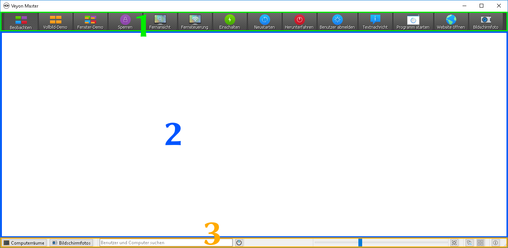
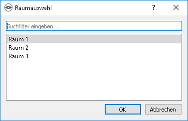

Einführung
==========

Veyon ist eine Applikation, mit der es möglich ist, einen Verbund von Computern (z. B. Klassen- oder Schulungsräume) auf einem zentralen Computer (z. B. Lehrer-PC) abzubilden, im Überblick zu behalten, zu steuern und verschiedene Funktionen und Modi zu verwenden.

Programmstart und Anmeldung
---------------------------

Das Programm wird über das :index:`Startmenü` oder ein :index:`Desktopsymbol` gestartet:

Abhängig von der Systemkonfiguration werden Sie nach :index:`Benutzername` und :index:`Passwort` gefragt:

.. image:: images/logon-dialog.png
   :align: center

Geben Sie hier Ihren Benutzernamen und Ihr Passwort ein oder – falls vorgegeben – die Zugangsdaten eines speziellen Lehrer-Kontos. Wenn die eingegebenen Daten korrekt sind und eine Anmeldung möglich ist, startet das Programm. Andernfalls wird die :index:`Anmeldung` verweigert und eine Fehlermeldung angezeigt. Sie können in diesem Fall eine erneute Eingabe versuchen.

Bedienoberfläche
----------------

Nach dem Programmstart sehen Sie die :index:`Bedienoberfläche` mit :index:`Werkzeugleiste` (1), :index:`Arbeitsfläche` (2) und der :index:`Statusleiste` mit verschiedenen Steuerelementen (3):

Die Werkzeugleiste beinhaltet eine Reihe an Schaltflächen zur Aktivierung von verschiedenen Funktionen. Eine detaillierte Beschreibung der einzelnen Funktionen befindet sich im Kapitel :ref:`Programmfunktionen`. Aussehen und Verhalten der Werkzeugleiste können – wie im Abschnitt :ref:`Werkzeugleiste` beschrieben – angepasst werden.

In der Arbeitsfläche werden alle zu beobachtenden Computer in einer :index:`Kachelansicht` dargestellt. Abhängig von der Systemkonfiguration und von vorherigen Programmstarts sehen Sie hier bereits die Computer des aktuellen Raums. Über die Computerraeume_ können Sie Computer oder ganze Computerräume ein- oder ausblenden.

Die Elemente in der Statusleiste dienen der Steuerung der Programmoberfläche und sind im folgenden Abschnitt genauer beschrieben.

Statusleiste
------------

Mit Hilfe der Schaltflächen :guilabel:`Computerräume` und :guilabel:`Bildschirmfotos` können Sie Ansichten wie die Computerraeume_ oder Bildschirmfotos_ öffnen und schließen.

Über die Suchleiste ist es möglich, die angezeigten Computer anhand von Suchbegriffen wie Computer- oder Benutzernamen zu filter. Technisch versierte Benutzer können hier sogar reguläre Ausdrücke eingeben, um fortgeschrittene Suchfilter zu realisieren.

Die Schaltfläche |powered-on| (Nur eingeschaltete Computer anzeigen) blendet alle Computer aus, die nicht eingeschaltet oder erreichbar sind. Das erlaubt die gleichzeitige Beobachtung einer großen Anzahl von Computer oder nur teilweise besetzten Räumen bei gleichzeitiger Fokussierung auf die tatsächlich aktiven Computer.

Über den Schieberegler können Sie die Größe der angezeigten Computerbildschirme steuern. Bei gedrückter Taste :kbd:`Strg` kann die Größe ebenfalls mit Hilfe des Maus-Scrollrads geändert werden. Eine automatische Anpassung auf die optimale Größe erfolgt bei Betätigung der rechts hiervon befindlichen Schaltfläche |zoom-fit-best| (:guilabel:`Optimale Größe einstellen`).

Seit Veyon 4.1 ist es möglich, eine benutzerdefinierte Computeranordnung zu verwenden, um z.B. die tatsächliche Anordnung von Computern im Klassenraum abzubilden. Jeder Computer kann nach Aktivierung der Schaltfläche |exchange-positions-zorder| (Benutzerdefinierte Computeranordnung verwenden) einzeln oder in gewählter Gruppe mit gedrückter Maustaste verschoben und nach Belieben angeordnet werden. Um alle Computer innerhalb einer eigenen Anordnung einheitlich auszurichten, kann die Schaltfläche |align-grid| (Computer an Gitter ausrichten) betätigt werden. Soll wieder die sortierte Standardanordnung verwendet werden, genügt es, die Schaltfläche |exchange-positions-zorder| wieder zu deaktivieren.

Die Schaltfläche |help-about| (:guilabel:`Über`) öffnet einen Dialog mit Informationen über Veyon wie z. B. Version, Hersteller und Lizenzbestimmungen.

.. _Werkzeugleiste:

Werkzeugleiste
--------------

Sie können das Aussehen und Verhalten der Werkzeugleiste an Ihre Wünsche anpassen. Mit einem Rechtsklick sowohl auf einen freien Bereich als auch eine Schaltfläche öffnet sich ein Kontextmenü mit mehreren Einträgen:

.. image:: images/toolbar-contextmenu.png
   :align: center

Wenn Sie den Eintrag :guilabel:`Balloon-Tooltips deaktivieren` anklicken, werden keine Tooltips mehr angezeigt, wenn Sie mit der Maus über die Schaltflächen fahren. Sie können das Kontextmenü jederzeit erneut öffnen und den Haken mit einem Klick wieder entfernen.

Die Option :guilabel:`Nur Icons anzeigen` bewirkt eine kompakte Darstellung der Schaltflächen in der Werkzeugleiste, indem die Beschriftungen ausgeblendet und nur Symbole angezeigt werden. Auf kleineren Bildschirmen ist diese Option unter Umständen notwendig, um alle Schaltflächen darstellen zu können.

.. _Computerraeume:

Computerräume
-------------

.. index:: Computerräume

Über die Schaltfläche :guilabel:`Computerräume` in der :index:`Statusleiste` können Sie die die Computerraumansicht öffnen. In dieser Ansicht werden alle verfügbaren Computerräume in einer Baumstruktur angezeigt. Einzelne Raumeinträge können Sie über ein üblicherweise dreieckiges Symbol aufklappen.

Sie können einzelne Computer oder ganze Räume aktivieren, indem Sie sie anhaken. Alle aktivierten Computer werden in der Arbeitsfläche angezeigt.

.. image:: images/computer-room-management.png
   :align: center

Über die Schaltfläche :guilabel:`Computer-/Benutzerliste speichern` können Sie die Liste der Computer und angemeldeten Benutzer in eine CSV-Datei speichern. Ein typischer Anwendungsfall hierfür ist eine Anwesenheitskontrolle zu einem späteren Zeitpunkt oder einer IT-gestützten Prüfung.

Je nach Systemkonfiguration steht zudem die Schaltfläche :guilabel:`Raum hinzufügen` zur Verfügung. Darüber können Sie weitere Computerräume zur Ansicht hinzufügen. Ein Klick auf die Schaltfläche öffnet einen Dialog, in dem Sie alle verfügbaren Räume sehen:

Sie können die Liste über das Eingabefeld filtern, also einen Suchbegriff eingeben. In der Liste werden dann nur noch die Raumnamen angezeigt, in denen der eingegebene Suchbegriff vorkommt. Fortgeschrittene Benutzer können auch reguläre Ausdrücke für den Filter verwenden. Anschließend können Sie den Raum auswählen und über :guilabel:`OK` bestätigen. Der gewählte Raum steht nun in der Raumliste bis zum nächsten Programmneustart zur Verfügung. Sie können einen hinzugefügten Raum auch wieder entfernen, indem Sie einen Raum anklicken und die Taste :kbd:`Entf` drücken.

.. _Bildschirmfotos:

Bildschirmfotos
---------------

.. index:: Bildschirmfotos

In der Verwaltungsansicht für Bildschirmfotos können Sie erstellte Bildschirmfotos einsehen und löschen. Im Kapitel :ref:`Programmfunktionen` wird die Funktion zum Erstellen eines Bildschirmfotos im Abschnitt :ref:`Bildschirmfoto` erläutert.

.. image:: images/screenshot-management.png
   :align: center

Sie können nun einzelne Bildschirmfotos in der Liste auswählen. Anschließend werden Details zum Bildschirmfoto wie Aufnahmedatum, Benutzername und Computer in der darunter befindlichen Tabelle angezeigt. Über die Schaltfläche :guilabel:`Anzeigen` oder einen Doppelklick in der Liste wird das gewählte Bildschirmfoto in voller Größe angezeigt. Wenn Sie das Bildschirmfoto nicht mehr benötigen, können Sie es mit Hilfe der Schaltfläche :guilabel:`Löschen` dauerhaft löschen. Bitte beachten Sie, dass dieser Vorgang nicht rückgängig gemacht werden kann und die Dateien auch nicht in den Papierkorb verschoben werden.
