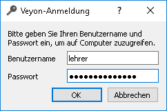
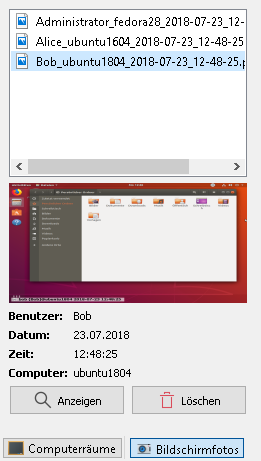

Einführung
==========

Veyon ist eine Software, mit der es möglich ist, einen Verband von Computern (z. B. Klassen- oder Schulungsräume) auf einem zentralen Computer (z. B. Lehrercomputer) im Überblick zu behalten, zu steuern und verschiedene Funktionen und Modi zu verwenden.

Programmstart und Anmeldung
---------------------------

Das Programm wird über das Startmenü oder ein Desktopsymbol gestartet:

.. image:: images/desktop-symbol.png

Abhängig von der Systemkonfiguration werden Sie nach Benutzername und Passwort gefragt:

Geben Sie hier Ihren Benutzername und Ihr Passwort ein oder falls vorgegeben die Zugangsdaten eines speziellen Lehrer-Kontos. Wenn die eingegebenen Daten korrekt sind und eine Anmeldung möglich ist, startet das Programm. Andernfalls wird die Anmeldung verweigert und eine Fehlermeldung angezeigt. Sie können in diesem Fall erneute Eingaben versuchen.

Bedienoberfläche
----------------

Nach dem Programmstart sehen Sie die Bedienoberfläche mit Werkzeugleiste (1), Arbeitsfläche (2) und der Statusleiste mit verschiedenen Steuerelementen (3):

.. image:: images/master-user-interface.png

Die Werkzeugleiste beinhaltet eine Reihe an Schaltflächen zur Aktivierung von verschiedenen Funktionen. Eine detaillierte Beschreibung der einzelnen Funktionen befindet sich im Kapitel :ref:`Programmfunktionen`.

In der Arbeitsfläche werden alle zu beobachtenden Computer in einer Kachelansicht dargestellt. Abhängig von der Systemkonfiguration und vorherigen Programmstarts sehen Sie hier bereits die Computer des aktuellen Raums. Über die Computerraumverwaltung_ können Sie Computer oder ganze Computerräume ein- oder ausblenden.

Die Elemente in der Statusleiste dienen der Steuerung der Programmoberfläche. So können Sie Ansichten wie die Computerraumverwaltung_ oder Bildschirmfotoverwaltung_ aktivieren. Über den Schieberegler können Sie die Größe der angezeigten Computerbildschirme steuern. Eine automatische Anpassung auf eine optimale Größe erfolgt bei der Betätigung der Schaltfläche **Auto**. Die Schaltfläche **Über** öffnet einen Dialog mit Informationen über das Programm wie z. B. Version, Hersteller und Lizenzbestimmungen.

.. _Computerraumverwaltung:

Computerraumverwaltung
----------------------

Über die Schaltfläche **Computerräume** in der Statusleiste können Sie die Computerraumverwaltung öffnen. In dieser Ansicht werden alle verfügbaren Computerräume in einer Baumansicht angezeigt. Einzelne Raumeinträge können Sie über ein üblicherweise dreieckiges Symbol aufgeklappen.

Sie können einzelne Computer oder ganze Räume aktivieren, indem Sie sie anhaken. Alle aktivierten Computer werden in der Arbeitsfläche angezeigt.

.. image:: images/computer-room-management.png

Über die Schaltfläche **Computer-/Benutzerliste speichern** können Sie die Liste der Computer und angemeldeten Benutzer in eine CSV-Datei speichern. Ein typischer Anwendungsfall hierfür ist eine Anwesenheitskontrolle zu einem späteren Zeitpunkt.

Je nach Systemkonfiguration steht zudem die Schaltfläche **Raum hinzufügen** zur Verfügung. Darüber können Sie weitere Computerräume zur Ansicht hinzufügen. Ein Klick auf die Schaltfläche öffnet einen Dialog, in dem Sie alle verfügbaren Räume sehen:

.. image:: images/room-selection.png

Sie können die Liste über das Eingabefeld filtern, also einen Suchbegriff eingeben. In der Liste werden dann nur noch die Raumnamen angezeigt, in denen der eingegebene Suchbegriff vorkommt. Fortgeschrittene Benutzer können auch reguläre Ausdrücke für den Filter verwenden. Anschließend können Sie einen Raum auswählen und über **OK** bestätigen. Der gewählte Raum steht nun in der Raumliste zur Verfügung.

.. _Bildschirmfotoverwaltung:

Bildschirmfotoverwaltung
------------------------

In der Verwaltungsansicht für Bildschirmfotos können Sie erstellte Bildschirmfotos einsehen und löschen. Im Kapitel :ref:`Programmfunktionen` wird die Funktion zum Erstellen eines Bildschirmfotos im Abschnitt :ref:`Bildschirmfoto` erläutert.

Sie können nun einzelne Bildschirmfotos in der Liste auswählen. Anschließend werden Details zum Bildschirmfoto wie Aufnahmedatum, Benutzername und Computer in der darunter befindlichen Tabelle angezeigt. Über die Schaltfläche **Anzeigen** oder einen Doppelklick in der Liste wird das gewählte Bildschirmfoto in voller Größe angezeigt. Wenn Sie das Bildschirmfoto nicht mehr benötigen, können Sie es mit Hilfe der Schaltfläche **Löschen** dauerhaft löschen. Bitte beachten Sie, dass dieser Vorgang nicht rückgängig gemacht werden kann und die Dateien auch nicht in den Papierkorb verschoben werden.
